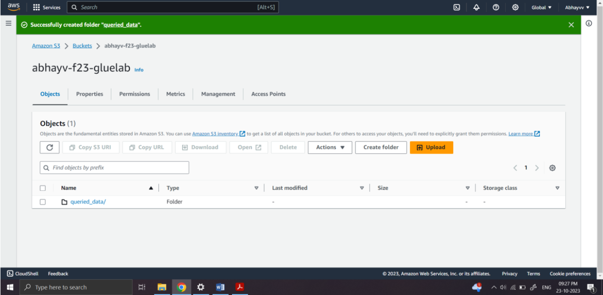
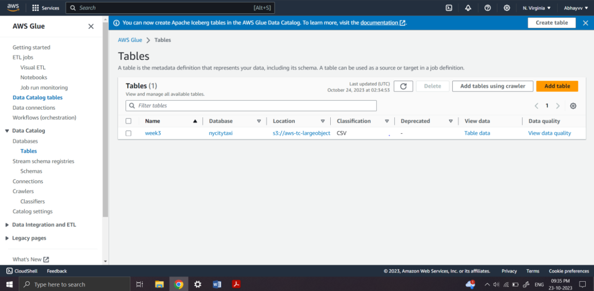
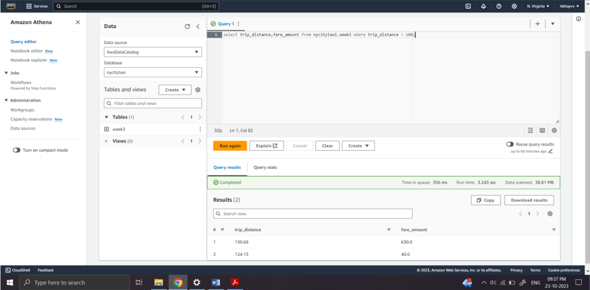
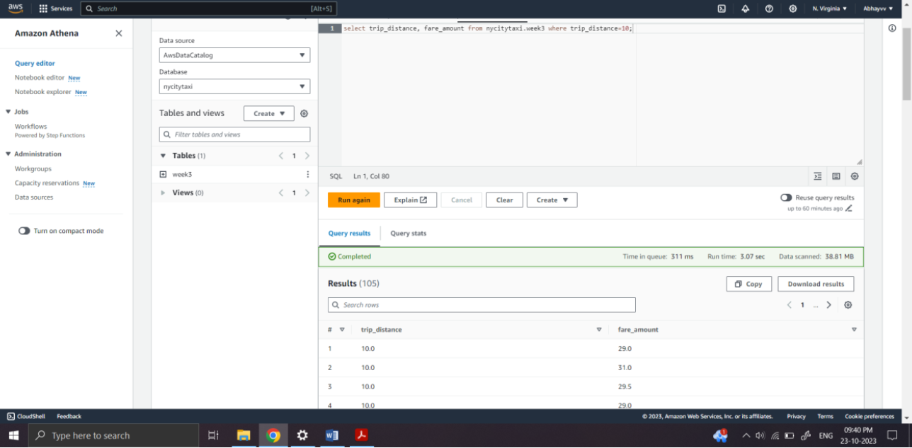

# NYC-taxi-data-analysis

## Objective

This project creates a data pipeline to extract taxi data to S3 and load data into AWS Glue for querying and analysis. 

## Dataset

Data is extracted from [Kaggle](https://www.kaggle.com/datasets/kentonnlp/2014-new-york-city-taxi-trips/) and saved locally.

## Output 

